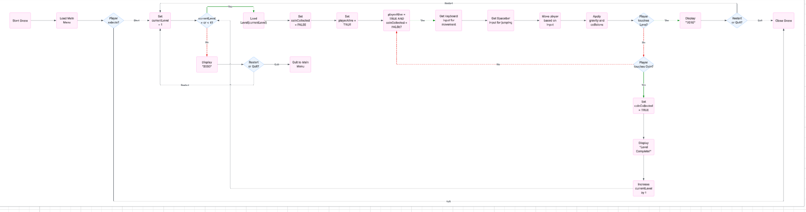
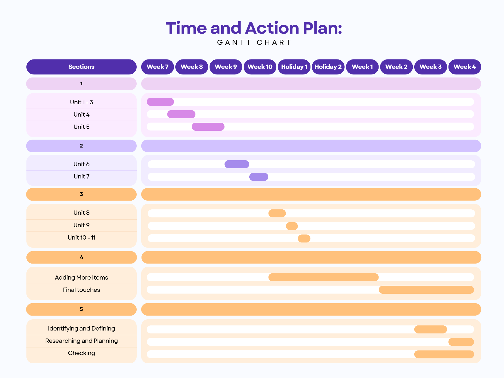

# **Unity Game Portfolio:**
#### _**Created by Pranav Balamurugan - 9CT1B**_

### **Objective:**
This Unity game project aims to be a 2D shooter game where player aim, shoot and dodge enemies. The goal is to use fast reflexes and also use precise movement to successfully complete the game.

### **Target Audience**
- **Age Group:** Teenagers (13+)
- **Interests:** Gaming (Action games, reflex challenges and Competitive Play)
- **Platform:** PC (Windows, Mac and Linux)

### **More Information on the Game**
- **Genre:** 

***
## _**Identifying and Defining:**_
### **Identifying a Need**:

Lorem ipsum

### **Requirements Outline:**

***

| Component | Description |
|-|-|
| **Inputs** | - Keyboard input for movement (WASD or arrow keys) |
|| - Mouse or touchscreen input for aiming and shooting |
|| - UI buttons for menu navigation |
| **Processing** | - Player movement and collision detection |
|| - Bullet instantiation and trajectory calculation |
|| - Enemy AI behavior like pathfinding and spawning |
|| - Score tracking and health managing |
| **Outputs** | - Visual feedback (explosions, score updates, health bar) |
|| - Sound effects (shooting, damage, power-ups) |
|| - Game Over screen and score summary |
| **Transmission**| - I dont need it for single-player mode but it will be needed for a multiplayer version
| **Storage** | - High Scores
|| - Player preferences like the volume of the sounds or sensitivity of the mouse
|| - Game Progress

### **Functional and Non-functional Requirements:**
***
| Functional Requirements | Non-Functional Requirements |
|-|-|
| - Player can move and Shoot | - Game Runs smoothly at 60 fps or above
| - Enemies Spawn and move towards the Player | - Responsive controls with less input lag
| - Collision detection between the bullets and the enemies | - Clear UI
| - Score increases when enemies are defeated | - Engaging sound with good visual effects
| - Player loses when Player health reaches zero | - Compatible with PC

### **Social and Ethical Issues:**
***
| Issue | Consideration |
|-|-|
|Violence| This game involves shooting, so it will use child-friendly graphics to avoid realistic violence |
|Accessibility| Controls will be simple and customiseable |
|Data Privacy| No personal Data will be collected or transmitted |

***
## _**Researching and Planning:**_

### **Evaluation of Existing Ideas:**

| Game | Plus | Minus | Interesting |
|-|-|-|-|
| **Doom Eternal** | - Smooth combat and fast movement | - Too violent for younger people | - It combines both fast reflexes with accuracy
|| - Engaging difficulty | - Requires high performance in PC | - Could help me with enemy AI and how a good one looks like
|| - Strong visual design ||
| **Fortnite** | - Highly customisable | - Can feel repetitive | - The use of building and fighting needs more skill
|| - Multiplayer interaction | - Some players find controls hard at first | - Interesting movement and dodging mechanics.
|| - Fun and fast paced || 
|| - Great use of building and dodging mechanics ||
| **Unity FPS Microgame** | - Easy to understand and Play | - Graphics are basic | - Shows how to set up shooting and movement quickly
|| - Good starting point to learn in unity | - AI enemies are very simple | - Good for testing ideas for my own game
|| - Runs smoothly on most computers |

### **Pseudocode:**

**For Each Level:**

    START GAME
        LOAD main menu
        IF player presses START
            START player health = 100
            START score = 0
            WHILE player health > 0
                GET input from keyboard and mouse
                MOVE player based on input
                IF player clicks shoot
                    SPAWN bullet at player position
                    PLAY shooting sound
                FOR each enemy
                    MOVE enemy toward player
                    IF bullet hits enemy
                        DESTROY enemy
                        ADD 10 points to score
                IF enemy collides with player
                    REDUCE player health
            IF player health = 0 or score = 500
                END
                IF player health = 0
                    DISPLAY "Game Over" screen with score
                IF score = 500
                    NEXT LEVEL

    END GAME

### **Flowchart:** 

### **Time and Action Plan: Gantt Chart** 

