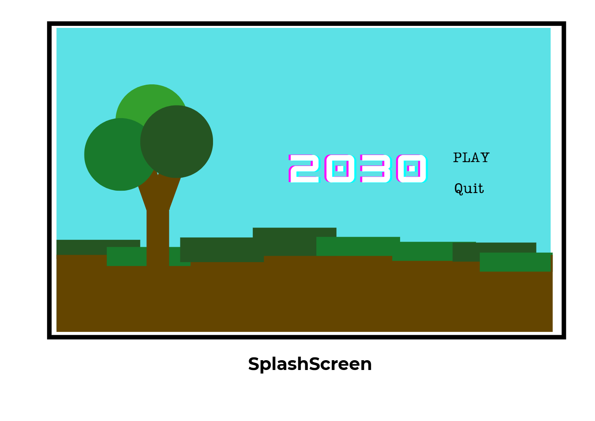
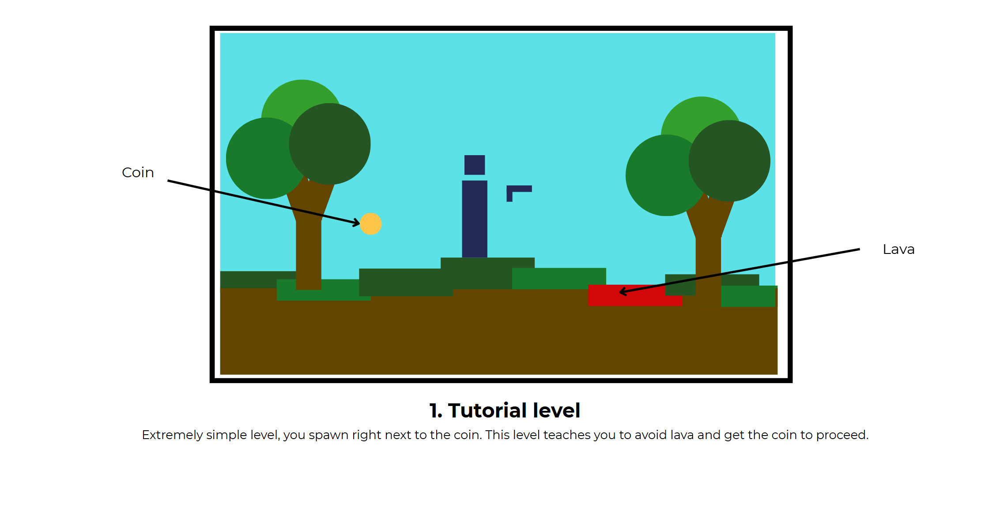
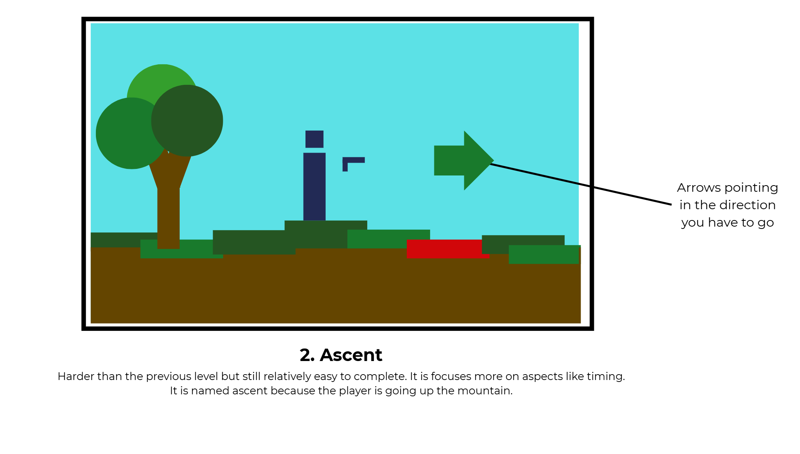
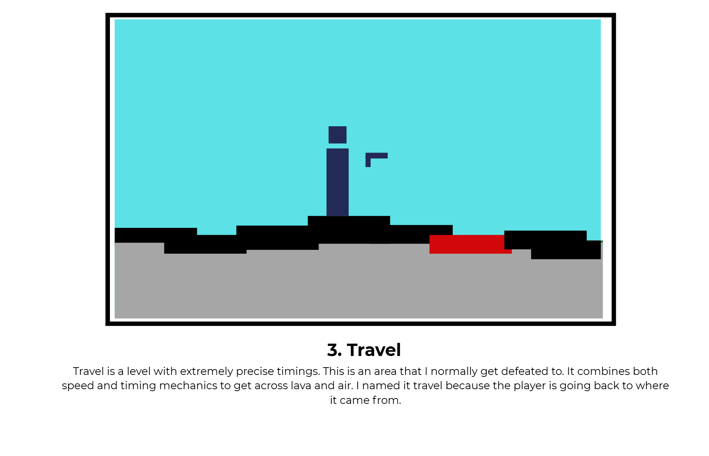
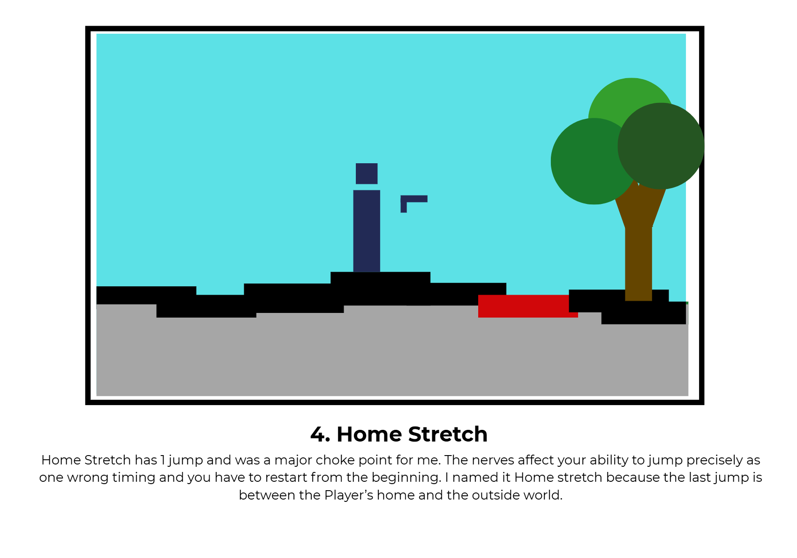

# **Unity Game Portfolio:**
#### _**Created by Pranav Balamurugan - 9CT1B**_

### **Objective:**
This Unity game project aims to be a 2D shooter game where player aim, shoot and dodge lava. The goal is to use fast reflexes and also use precise movement to successfully complete the game.

### **Narrative:**
As the Player heads home, he finds rare coins along the way and starts collecting them. His journey takes him through tall mountains and old, broken cities. After a long adventure, he finally reaches home, carrying the coins and memories of his travels.

### **Target Audience**
- **Age Group:** Teenagers (13+)
- **Interests:** Gaming (Action games, reflex challenges and Competitive Play)
- **Platform:** PC (Windows, Mac and Linux)

### **More Information on the Game**
- **Genre:** 2d shooter
- **Game View:** Side view
- **Main Objective:** Survive different levels which by moving and avoiding lava to reach the coin.
- **Game Mode:** Single-player offline

***
## _**Identifying and Defining:**_
### **Identifying a Need**:

Most games available today are 3d and often include complex controls, heavy graphics and violent themes. However, there are not many simple, fun and skill based 2d shooting games that are fun for teenagers. There is a need for a light 2D action game that focuses more on reflexes and time rathen than realism. My project attempts to meet that by making a fast-paced 2d game in Unity.

### **Requirements Outline:**

***

| Component | Description |
|-|-|
| **Inputs** | - Keyboard input for movement (WASD or arrow keys) |
|| - Mouse or touchscreen input for aiming and shooting |
|| - UI buttons for menu navigation |
| **Processing** | - Player movement and collision detection |
|| - Level tracking and if Player touches lava|
| **Outputs** | - Visual feedback (using Unity's Particle System) |
|| - Game Over screen with buttons for restarting and quitting |
| **Transmission**| - I dont need it for single-player mode but it will be needed for a multiplayer version
| **Storage** | - No data needs to be stored

### **Functional and Non-functional Requirements:**
***
| Functional Requirements | Non-Functional Requirements |
|-|-|
| - Player can move and Shoot | - Game Runs smoothly at 60 fps or above
| - Collision detection between the bullets and the enemies| - Responsive controls with less input lag
| - Proceeds to next level if touching coin  | - Clear UI
| - Player loses when Player touches lava or falls off the map| - Engaging sound with good visual effects
| - If player clicks restart, start at level 1| - Compatible with PC

### **Social and Ethical Issues:**
***
| Issue | Consideration |
|-|-|
|Violence| This game involves shooting, so it will use child-friendly graphics to avoid realistic violence |
|Accessibility| Controls will be simple like using WASD, Arrow keys and mouse.  |
|Data Privacy| No personal Data will be collected or transmitted |

***
## _**Researching and Planning:**_

### **Evaluation of Existing Ideas:**

| Game | Plus | Minus | Interesting |
|-|-|-|-|
| **Doom Eternal** | - Smooth combat and fast movement | - Too violent for younger people | - It combines both fast reflexes with accuracy
|| - Engaging difficulty | - Requires high performance in PC | - Could help me with enemy AI and how a good one looks like
|| - Strong visual design ||
| **Fortnite** | - Highly customisable | - Can feel repetitive | - The use of building and fighting needs more skill
|| - Multiplayer interaction | - Some players find controls hard at first | - Interesting movement and dodging mechanics.
|| - Fun and fast paced || 
|| - Great use of building and dodging mechanics ||
| **Unity FPS Microgame** | - Easy to understand and Play | - Graphics are basic | - Shows how to set up shooting and movement quickly
|| - Good starting point to learn in unity | - AI enemies are very simple | - Good for testing ideas for my own game
|| - Runs smoothly on most computers |

### **Pseudocode:**

**For Each Level:**

    START GAME
        LOAD Main Menu

        IF player selects "Start"
            SET currentLevel = 1

            WHILE currentLevel SMALLER THAN or EQUAL to 4
                LOAD Level(currentLevel)
                SET coinCollected = FALSE
                SET playerAlive = TRUE

                WHILE playerAlive = TRUE AND coinCollected = FALSE
                    GET keyboard input (A/D or arrow keys) for movement
                    GET Spacebar input for jumping

                    MOVE player based on input
                    APPLY gravity and collisions

                    IF player touches Lava
                        DISPLAY "2030"
                        ASK "Restart or Quit?"
                        IF player chooses "Restart"
                            RESTART game from Level 1
                        ELSE
                            CLOSE window
                        END IF

                    IF player touches Coin
                        SET coinCollected = TRUE
                        INCREASE currentLevel by 1

                END WHILE
            END WHILE

            DISPLAY "2030"
            ASK "Restart or Quit?"
            IF player chooses "Restart"
                RESTART game from Level 1
            ELSE
                QUIT to Main Menu
            END IF

        ELSE IF player selects "Exit"
            CLOSE game

    END GAME

### **Flowchart:** 

### **StoryBoards:**

### **Time and Action Plan: Gantt Chart** 

